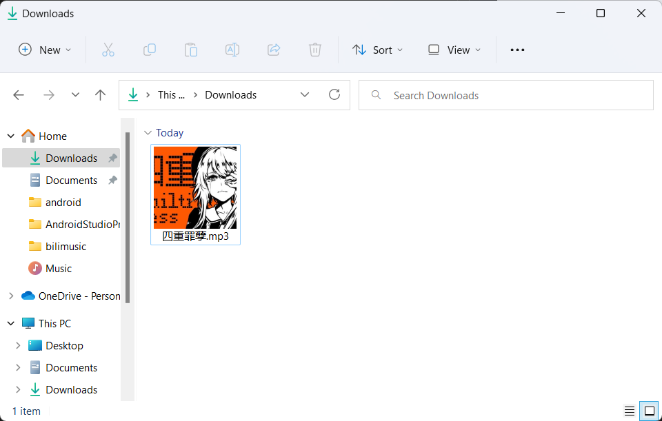
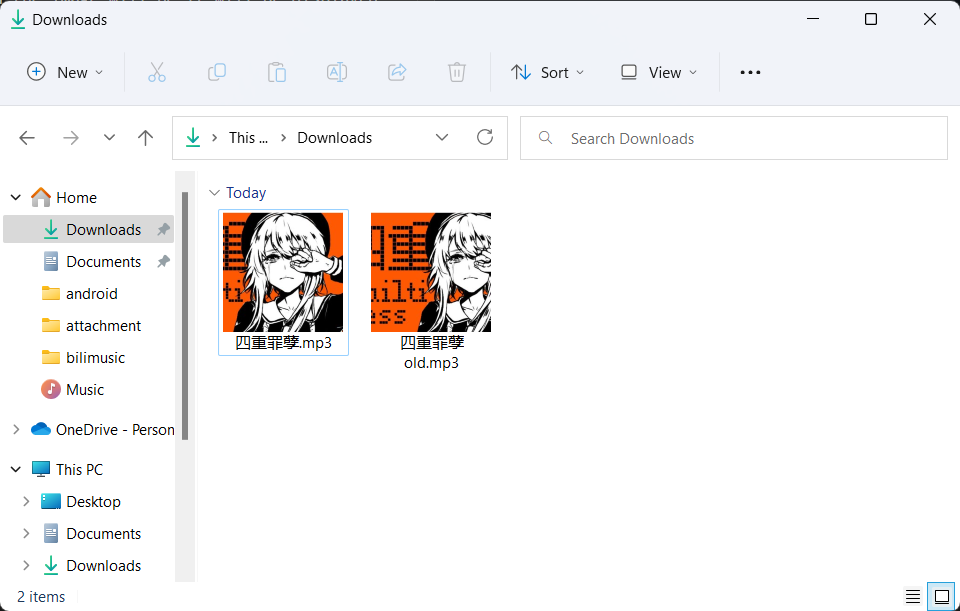

# BiliMusic

BiliMusic helps you to download `mp3` music file from `bilibili` video.
Compared to a lot of same type applications and scripts, **BiliMusic can do more, it can set metadata on mp3 file automatically.**

## How to Install

```
pip install bilimusic
```

## Basic Usage

You can just type that to install a music:

```
bilimusic BV1us411X7hb
```

Or, you can use the av number(broken now):

```
bilimusic 4188543
```

Url is ok, the same time.

```
bilimusic https://www.bilibili.com/video/BV1us411X7hb?spm_id_from=333.337.search-card.all.click
```

the music file will happen in the path where you type the command, and be set some metadata.

The metadata is gotten from bilibili website.
But, the metadata from bilibili is not very suitable, because it's a website website, not a music website.
Such as, the publisher may be different from artist, video title may include some metadata so that it can't be used by mp3 file directly, because that will be so messy.

To solve the problem, you can input some data and flags when you download the music file.

```
bilimusic BV1us411X7hb -t 四重罪孽 -ar 洛天依 -al 妄想症
```

You can type that to check all the parameters and flags:

```
bilimusic --help
```

So, that's what you get. You may see, the cover if cut to a square, and it looks a little out of place. You may wana to place the girl's face more in the middle.



Then we can specify an offset amount for the cover (negative number means left, positive number means right), offset amount should be a float type value between -1.0 and 1.0.

if you specify offset as negative 1.0, then the image will be It will be displayed from the far left, and the same is true for 1.0.

You can type that to specify offset to cover:

```
bilimusic BV1us411X7hb -t 四重罪孽 -ar 洛天依 -al 妄想症 -o 1.0
```

And that's what you get.



As you may have noticed, this song has multiple singers, but I only named one. This is because the players do not recognize the situation of multiple singers. So not only is it pointless to do that, it could also mess up your music collection.

## Super resolution

Sometimes, the video has a low-quality cover. 

It would be really annoying if the mp3 file had a too low resolution cover. Because they don't appear as big as other files in some views.

However, I've provided automatic super-resolution processing that can figure out low-quality that covers are too low resolution and increase its resolution them. It's not a simple "zoom in and out", it will also make the cover of the song clearer.

## Todo

I don't know is there some other things that I can do. So if you guys find something useful, you can just mention it in the issue.


